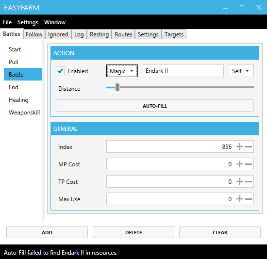

# Finding action index values
There are a few easy ways to find action index values need to cast the newer spells.

## Updating the resources folder
Chances are the resource folder is out of date and a newer version may contain the index values you need.

Easy Farm uses Windower's resource files to prefill most action information. If you're using Windower, you can use its resources folder which can be found here:
* Path\To\Windower\Windower4\plugins\resources

Then, delete EasyFarm's resource folder and replace it with Windower's.

## Getting the index from DSP's action database tables
Now, if that doesn't work you can try one of the values in darkstar project's action database table files. I'm not sure if they'll work, but it's worth a shot!

 * [Spells](https://github.com/DarkstarProject/darkstar/blob/master/sql/spell_list.sql)
 * [Weaponskills](https://github.com/DarkstarProject/darkstar/blob/master/sql/weapon_skills.sql)
 * [Abilities](https://github.com/DarkstarProject/darkstar/blob/master/sql/abilities.sql)

### Example Time!
Now, if we look at the spells link above, we see that the first values after `Values` are the index values, followed by the spell's name.

*Bear with me if the following looks complicated, but the process won't be too bad ^^;*

----------------------------------------------------

-- INSERT INTO `spell_list` VALUES ('**849', 'fire_vi'**, 0x00000063000000000000000000000000000000000000, '2', '1', '0', '4', '36', '0', '0', '0', '2', '252', '957', '4000', '0', '35', '1.00', '0', '0', '0', '204','SOA');

-- INSERT INTO `spell_list` VALUES ('**850', 'blizzard_vi'**, 0x00000063000000000000000000000000000000000000, '2', '5', '0', '4', '36', '0', '0', '0', '2', '252', '958', '4000', '0', '35', '1.00', '0', '0', '0', '204','SOA');

-- INSERT INTO `spell_list` VALUES ('**851', 'aero_vi'**, 0x00000063000000000000000000000000000000000000, '2', '4', '0', '4', '36', '0', '0', '0', '2', '252', '959', '4000', '0', '35', '1.00', '0', '0', '0', '204','SOA');

-- INSERT INTO `spell_list` VALUES ('**852', 'stone_vi'**, 0x00000063000000000000000000000000000000000000, '2', '2', '0', '4', '36', '0', '0', '0', '2', '252', '960', '4000', '0', '35', '1.00', '0', '0', '0', '204','SOA');

-- INSERT INTO `spell_list` VALUES ('**853', 'thunder_vi'**, 0x00000063000000000000000000000000000000000000, '2', '6', '0', '4', '36', '0', '0', '0', '2', '252', '961', '4000', '0', '35', '1.00', '0', '0', '0', '204','SOA');

-- INSERT INTO `spell_list` VALUES ('**854', 'water_vi'**, 0x00000063000000000000000000000000000000000000, '2', '3', '0', '4', '36', '0', '0', '0', '2', '252', '962', '4000', '0', '35', '1.00', '0', '0', '0', '204','SOA');

-- INSERT INTO `spell_list` VALUES ('**855', 'enlight_ii'**, 0x00000000006300000000000000000000000000000000, '2', '7', '0', '4', '34', '0', '0', '0', '2', '252', '980', '4000', '0', '35', '1.00', '0', '0', '0', '204','SOA');

-- INSERT INTO `spell_list` VALUES ('**856', 'endark_ii'**, 0x00000000000063000000000000000000000000000000, '2', '8', '0', '4', '34', '0', '0', '0', '2', '252', '981', '4000', '0', '35', '1.00', '0', '0', '0', '204','SOA');

----------------------------------------------------

Now, with the highlighted values we found, we can build the following list:

Index | SpellName
---|---
856 | endark_ii
855 | enlight_ii
854 | water_vi
853 | thunder_vi
852 | stone_vi
851 | aero_vi
850 | blizzard_vi
849 | fire_vi

### Using the index values

You can use these index values in the General Options tab of EasyFarm by:

1. Right clicking on an action.
2. Select "General Options"
3. Find Index, and enter in the value.

