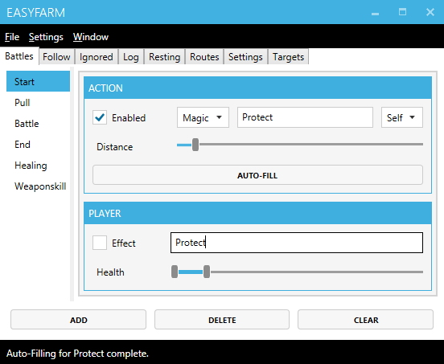

# Creating a buffing spell

## Setting up the action.
1. Select the **Start** tab.
2. Type the action's **Name** into the textbox.
4. Check the **Enabled** checkbox.
5. Click the **Autofill** button.

*This will prefill common settings like MPCost, Prefix, Target and Index some of which can be accessed through the right-click context menu.*

## Configuring action to be used on status effect missing  
To make the buffing spell fire when status effect wears off do the following:

1. **Right-click** on the action.
2. Select **Player Options**.
2. Type the status effect's **Name** into the effect textbox.

*The buffing action will be used when the player is missing the specified status effect.*

