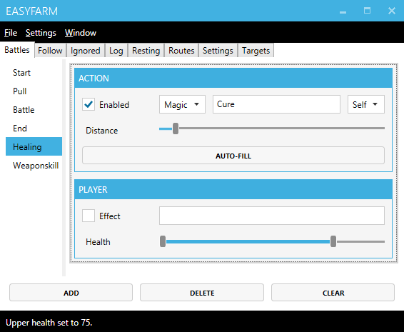

# Creating a curing spell
These are the steps needed in order to setup a healing spell that will heal the player when their health falls within a specified range.

## Setting up the action.
1. Select the **Healing** tab.
2. Type the action's **Name** into the textbox.
4. Check the **Enabled** checkbox.
5. Click the **Autofill** button.

*This will prefill common settings like MPCost, Prefix, Target and Index some of which can be accessed through the right-click context menu.*

## Setting the health threshold
To adjust the health range in which the healing spell should be used, you'll need to do the following:

1. **Right-click** on the action.
2. Select **Player Options**
2. Adjust the **Health** slider's ticks to set the range when this action should be triggered.

*The healing spell will be used when the player's health is within the range set.*

