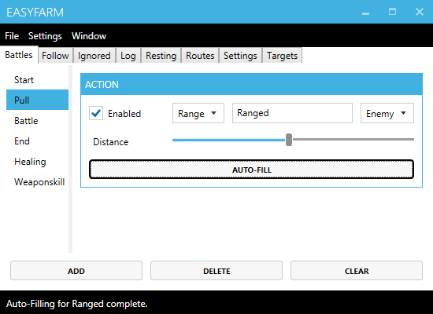

## Creating a pulling action
1. Select the **Pull** tab.
2. Type the action's **Name** into the textbox.
3. Adjust the **Distance** slider for melee or ranged actions.
4. Check the **Enabled** checkbox.
5. Click the **Autofill** button.

*This will prefill common settings like Prefix, Target and Index
some of which can be accessed through the right-click context menu.*

